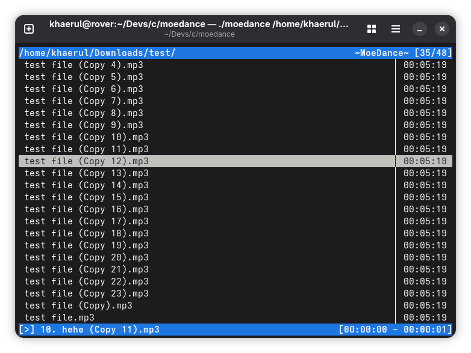

# [WIP]

## MoeDance - A pretty simple music player



### KISS: Keep it simple and suckless:
1. Sorted by file name.
2. Configuration only occurs at compile time by editing `config.h` file.
3. No mouse input.
4. Vi-like keyboard shortcuts.
5. No fancy stuff; ie: no `n/curses`.


### Supported file extensions (thanks to: `ffmpeg`):
1. MP3
2. FLAC
3. WAV
4. And many more!


### Keyboard shortcuts:
```
1. Up:                 k           [OR]  <ARROW UP>
2. Down:               j           [OR]  <ARROW DOWN>
3. Scroll up:          <CTRL> + u  [OR]  <PAGE UP>
4. Scroll down:        <CTRL> + d  [OR]  <PAGE DOWN>
5. Go to top:          gg          [OR]  <HOME>           [TODO]
6. Go to bottom:       G           [OR]  <END>            [TODO]
7. Next:               n
8. Prev:               p
9. Play:               <ENTER>
10. Toggle Play/Pause: <SPACE>
11. Stop:              s
12. Quit:              q
```


### Required jackages
1. ffmpeg (tested on: 7.1.2 (fedora 43))
2. portaudio (tested on: fedora(43))


### How to build and run
```
        * Install packages: (fedora 43)
            dnf install ffmpeg-devel portaudio-devel

        * Run
            make
        
        * And then... ('~/Music' by default)
           ./moedance [PATH]
```


### License:
MIT

